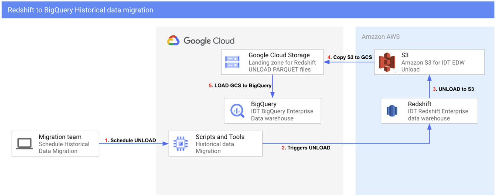

# redshift-bq-migration
Redshift to BigQuery migration require the following steps.



```sh
nohup python3 unload_sortkey_v3.py > idt_rpt_common_downloads_6_7_2023.out &
```

# Script for copy from S3 to Google Cloud Storage

```sh
./download_s3.sh 
```

# Script for loading from Google Cloud Storage to Google BigQuery

```sh
./bq_load_tables.sh
```